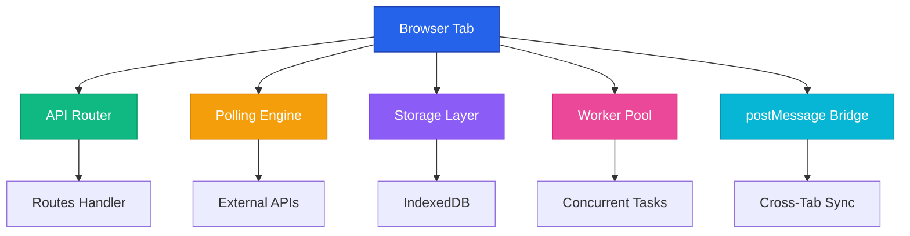

#  API in Browser

<div align="center">

**Turn any browser tab into a REST API server. Zero backend needed.**

[](https://www.npmjs.com/package/api-in-browser)
[](https://www.npmjs.com/package/api-in-browser)
[](https://github.com/Tryboy869/api-in-browser)
[](LICENSE)

[](https://github.com/Tryboy869/api-in-browser/actions)
[](https://bundlephobia.com/package/api-in-browser)
[](https://www.typescriptlang.org/)


[📦 Install](#-quick-start) • [📖 Docs](https://github.com/Tryboy869/api-in-browser/tree/main/docs) • [🎯 Examples](#-examples) • [💬 Community](https://github.com/Tryboy869/api-in-browser/discussions)

</div>

---

## 🎯 What This Is

```javascript
import API from 'api-in-browser';

const api = new API();

api.get('/hello', (req, res) => {
  res.json({ message: 'Hello from your browser!' });
});

api.listen(); // API running — no server needed
```

A framework that transforms your browser into a **fully functional REST API server** using:

<div align="center">

| Feature | Technology |
|---------|------------|
| 🔄 **Request Handling** | Polling / Service Workers |
| 💾 **Storage** | IndexedDB (60GB+) |
| 🔗 **Cross-Tab** | postMessage API |
| ⚡ **Concurrency** | Web Workers |

</div>

**Perfect for:**
- 🤖 Telegram bots running in a browser tab
- 💼 Local-first apps with zero backend cost
- 🧪 Prototyping APIs without servers
- 🌐 P2P applications
- ⚡ Edge computing experiments

---

## 🚀 Quick Start

### Installation

```bash
npm install api-in-browser
```

Or use CDN:

```html
<script type="module">
  import API from 'https://cdn.jsdelivr.net/npm/api-in-browser/src/index.js';
</script>
```

### Your First API (30 seconds)

```javascript
import API from 'api-in-browser';

const api = new API({
  polling: true,
  pollingInterval: 2000
});

// Define routes
api.get('/users', async (req, res) => {
  const users = await api.storage.getAll('users');
  res.json(users);
});

api.post('/users', async (req, res) => {
  const user = req.body;
  await api.storage.set('users', user.id, user);
  res.json({ success: true, user });
});

// Start
api.listen(() => console.log('🚀 API running in browser'));
```

---

## ✨ Features

<table>
<tr>
<td width="50%">

### 🎯 REST API in Browser
- GET, POST, PUT, DELETE, PATCH
- Query parameters & body parsing
- Response helpers (json, text, status)

### 💾 Built-in Storage
- IndexedDB wrapper (simple API)
- 60GB+ quota (Chrome/Firefox)
- Persistent across sessions

</td>
<td width="50%">

### 🤖 Telegram Bot Support
- Long-polling built-in
- Webhook simulation
- Message queue management

### 🔗 Cross-Tab Communication
- Broadcast updates
- Shared state
- Event synchronization

</td>
</tr>
</table>

---

## 💡 Examples

### 1️⃣ Simple Counter API

```javascript
import API from 'api-in-browser';

const api = new API();
let counter = 0;

api.get('/counter', (req, res) => {
  res.json({ count: counter });
});

api.post('/counter/increment', (req, res) => {
  counter++;
  res.json({ count: counter });
});

api.listen();
```

### 2️⃣ Telegram Bot

```javascript
import API from 'api-in-browser';

const api = new API({ polling: true, pollingInterval: 2000 });
const TOKEN = 'YOUR_BOT_TOKEN';

api.telegramBot(TOKEN, {
  '/start': (msg) => `Hello ${msg.from.first_name}!`,
  '/help': () => 'Available commands: /start, /help, /ping',
  '/ping': () => 'Pong! 🏓'
});

api.listen();
```

### 3️⃣ Todo List with Storage

```javascript
import API from 'api-in-browser';

const api = new API();

api.get('/todos', async (req, res) => {
  const todos = await api.storage.getAll('todos');
  res.json(todos);
});

api.post('/todos', async (req, res) => {
  const todo = { id: Date.now(), ...req.body };
  await api.storage.set('todos', todo.id, todo);
  res.json(todo);
});

api.delete('/todos/:id', async (req, res) => {
  await api.storage.delete('todos', req.params.id);
  res.json({ success: true });
});

api.listen();
```

[📂 More Examples](https://github.com/Tryboy869/api-in-browser/tree/main/examples)

---

## 🏗️ Architecture

<div align="center">



**How it works:**
1. Routes defined via `api.get()`, `api.post()`, etc.
2. Polling mode checks external APIs every N seconds
3. Requests routed to handlers
4. IndexedDB for data persistence
5. postMessage for multi-tab sync

</div>

---

## ⚠️ Limitations

<div align="center">

| Aspect | Reality | Use Case |
|--------|---------|----------|
| **Uptime** | Runs while tab is open | ✅ Personal tools |
| **Concurrency** | ~10-50 req/sec | ✅ Small groups |
| **Storage** | 60GB (Chrome/Firefox) | ✅ Local-first |
| **Mobile** | May pause in background | ⚠️ Desktop recommended |
| **Security** | Your IP = API IP | ✅ Private use |

</div>

**Perfect for:**
- ✅ Personal bots & small group tools
- ✅ Prototyping & MVPs
- ✅ Local-first applications
- ✅ P2P experiments

**Not suitable for:**
- ❌ Production high-traffic APIs
- ❌ Apps requiring 24/7 uptime

---

## 📖 API Reference

### Initialization

```javascript
const api = new API(options);
```

<details>
<summary><b>Options</b></summary>

- `polling` (boolean): Enable polling mode for external requests
- `pollingInterval` (number): Polling frequency in ms (default: 2000)
- `cors` (boolean): Enable CORS headers (default: true)
- `storage` (string): Storage backend — 'indexeddb' or 'memory'
- `debug` (boolean): Enable debug logging

</details>

### Routes

```javascript
api.get(path, handler)    // Define GET route
api.post(path, handler)   // Define POST route
api.put(path, handler)    // Define PUT route
api.delete(path, handler) // Define DELETE route
api.patch(path, handler)  // Define PATCH route
```

**Handler signature:**
```javascript
(req, res) => {
  // req: { method, path, params, query, body }
  // res: { json(), text(), setStatus() }
}
```

### Storage

```javascript
await api.storage.set(store, key, value)    // Store data
await api.storage.get(store, key)           // Retrieve data
await api.storage.getAll(store)             // Get all items
await api.storage.delete(store, key)        // Delete item
await api.storage.clear(store)              // Clear store
```

[📚 Full API Documentation](https://github.com/Tryboy869/api-in-browser/tree/main/docs)

---

## 🌟 Philosophy

<div align="center">

> *"The browser is the most distributed computer on Earth. Let's use it."*

This framework embraces **Informatique Réalitaire** (Reality Computing) — building systems that work *with* physical constraints rather than against them.

No pretense of being a server. It's a browser that behaves like a server *when needed*.

</div>

---

## 👨‍💻 Author

<div align="center">


**Daouda Abdoul Anzize** — Computational Paradigm Designer

*"I don't build apps. I build the clay others use to build apps."*

24 years old • Cotonou, Bénin → Global Remote

</div>

### 🧬 What I Create

- **Meta-Architectures** → Systems that absorb multiple programming paradigms
- **Universal Protocols** → Standards for distributed systems reliability
- **Emergent Computing** → Solutions arising from simple physical laws
- **AI Infrastructure** → Collective intelligence platforms

### 🔬 Featured Research

- **NEXUS AXION** — Universal computational framework
- **Nexus Backpressure Protocol** — 60%+ latency reduction in distributed systems
- **Informatique Réalitaire (IR)** — Framework for artificial cognition
- **Weak Hardware Booster** — 95% CPU reduction via semantic collision convergence

### 🛠️ Stack


### 📫 Contact

[](mailto:anzizdaouda0@gmail.com)
[](https://tryboy869.github.io/daa)
[](https://twitter.com/Nexusstudio100)
[](https://linkedin.com/in/anzize)

🎯 **Currently seeking:** Research engineering roles, AI infrastructure positions, Protocol design opportunities (Q1 2026)

---

## 📄 License

<div align="center">

MIT © 2026 Daouda Abdoul Anzize

**Permission granted** to use, modify, and distribute.  
Attribution appreciated but not required.

</div>

---

## 🙏 Acknowledgments

Inspired by:
- The **Local-First** movement
- **CRDTs** and distributed systems research
- **Service Workers** specification
- **IndexedDB** as underrated infrastructure

Built with the philosophy that **constraints breed creativity**.

---

## 🔗 Links

<div align="center">

[](https://github.com/Tryboy869/api-in-browser)
[](https://www.npmjs.com/package/api-in-browser)
[](https://github.com/Tryboy869/api-in-browser/tree/main/docs)
[](https://github.com/Tryboy869/api-in-browser/tree/main/examples)
[](https://github.com/Tryboy869/api-in-browser/issues)
[](https://github.com/Tryboy869/api-in-browser/discussions)

</div>

---

<div align="center">

**Made with ❤️ by Anzize**

*Proof that creativity transcends credentials*


</div>
